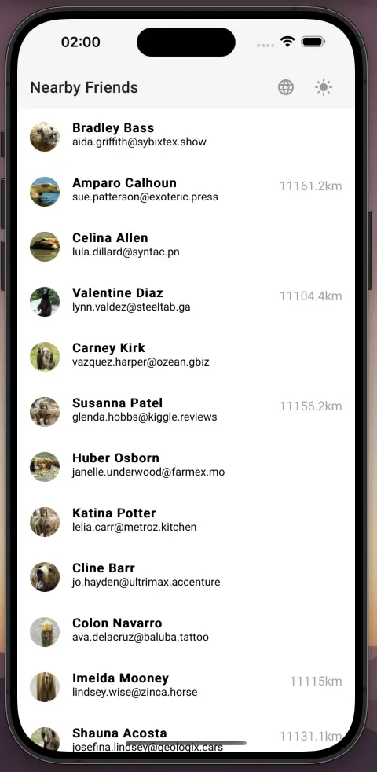
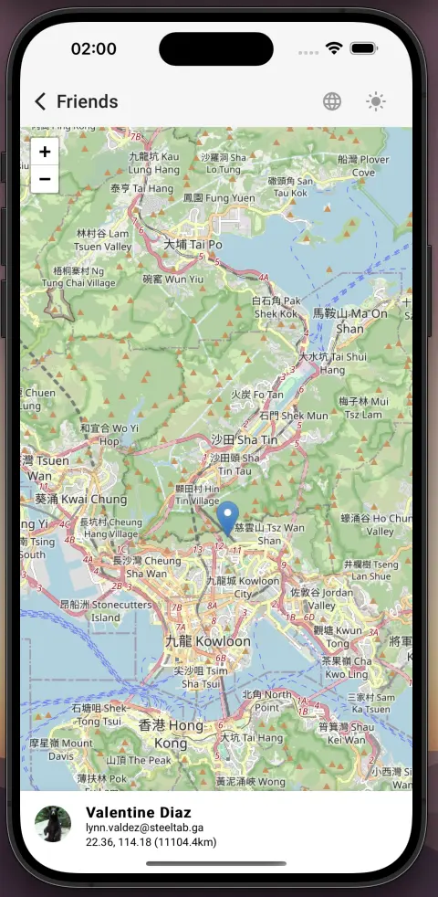
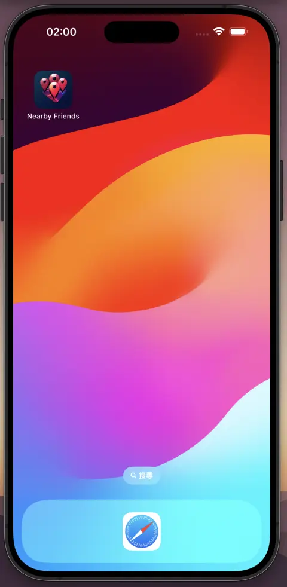

# Test

## Q1

Run `node q1/index.js`, check console log and assertion result

## Q2 - "Nearby Friends"

Live demo: [https://test-ajfnasdlknsd.web.app](https://test-ajfnasdlknsd.web.app)

This is a SPA aim to showing your friends' location.

To get started, run `cd q2`, `yarn` and `yarn start`.

### Features

- Showing friend location and fallback message if location is incomplete / unknown
- Responsive design for desktop, tablet and mobile

  
  

- PWA support with icon and theme

  

- State management with [Angular Signal](https://angular.dev/guide/signals#writable-signals)
- Design for failure, cache API response and use as fallback data (sometimes it returns 429)
- Virtual scroll on contact list to avoid performance issue
- Skeleton list item for UX improvement
- Lazyload images for performance improvement and save bandwidth
- Page transition with view transition API
- Showing distance between your location and the contact, via geolocation API

### Tech Used

- [TypeScript 5.3](https://www.typescriptlang.org/)
- [Angular 17](https://angular.dev/) with standalone component (moduleless) and signal
- Page transition with latest [View Transitions API](https://developer.mozilla.org/en-US/docs/Web/API/View_Transitions_API)
- [Web App Manifest](https://developer.mozilla.org/en-US/docs/Web/Manifest) and [Service Worker API](https://developer.mozilla.org/en-US/docs/Web/API/Service_Worker_API)
- [Geolocation API](https://developer.mozilla.org/en-US/docs/Web/API/Geolocation_API)
- [Tailwind CSS](https://tailwindcss.com/)
